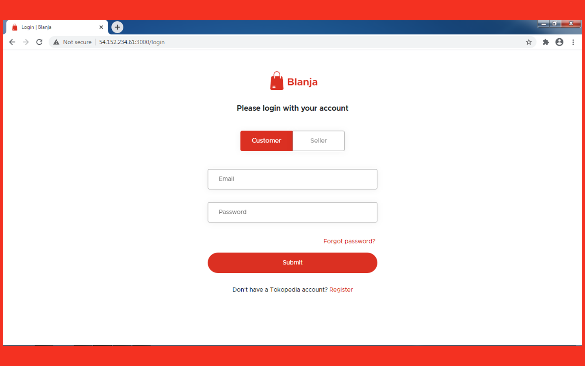
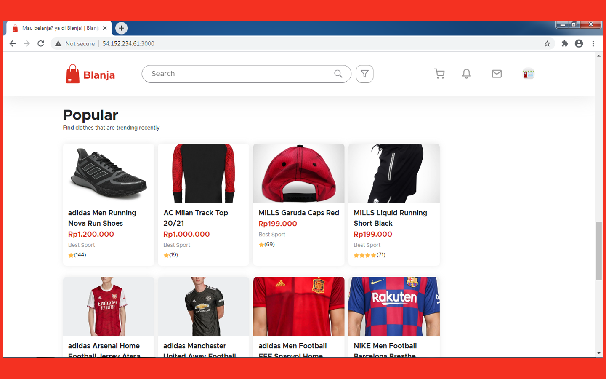
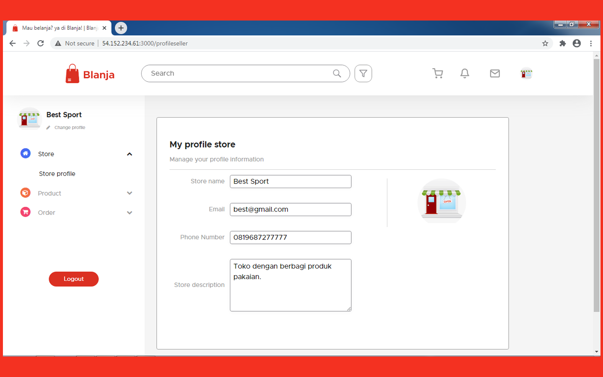

# Blanja Web 

<div align="center">
    
</div>

## Contents

- [Description](#description)
- [Features](#features)
- [Requirements](#requirements-for-development)
- [Installation](#installation-for-development)
- [Screenshoots](#screenshoots)
- [Demo Blanja Web](#demo-blanja-web)
- [Related Project](#related-project)

## Description

**Blanja Web** is a web-based e-commerce application that allows buyers to order
products of their choice. Consists of 2 types of users, namely buyers and
sellers.

## Features

- Order product
- History transaction
- Add product (sellers only)
- Chat
- Edit profile
- Reset Password
- etc

## Requirements for Development

- [`Node Js`](https://nodejs.org/en/)
- [`npm`](https://www.npmjs.com/get-npm)
- [`ReactJs`](https://reactjs.org/)
- [`Blanja Backend`](https://github.com/Baruak-da-Familia/blanja-api.git)

## Installation for Development

1. Open your terminal or command prompt
2. Type `git clone https://github.com/Baruak-da-Familia/blanja-frontend.git`
3. Open the folder and type `npm install` for install dependencies
4. Create file **_.env_** in root directory with the following contents :

```bash
REACT_APP_API_URL = "http://host_backend:port_backend"
REACT_APP_SOCKET_URL = "http://host_backend:port_socket"
REACT_APP_WEB_URL = "http://host_frontend:port_frontend"
```

Example :

- http://host_backend:port_backend is http://localhost:8000
- http://host_backend:port_socket is http://localhost:8001
- http://host_frontend:port_frontend is http://localhost:3000

so, you can write in .env file like this :

```bash
REACT_APP_API_URL = "http://localhost:8000"
REACT_APP_SOCKET_URL = "http://localhost:8001"
REACT_APP_WEB_URL = "http://localhost:3000"
```

5. Before run this, you must installation backend and then run backend
6. Type `npm start` in terminal for running this project.
7. If you want to build, type `npm run build`.

## Screenshoots

<div align="center">
    
    
    
</div>

## Demo Blanja Web

This is Blanja Web build version, let's try it.

<a href="http://54.175.146.137:3000/">
  
</a>

## Related Project

RESTful API for this web application, clone this for development Blanja Web.

<a href="https://github.com/Baruak-da-Familia/blanja-api.git">

</a>
